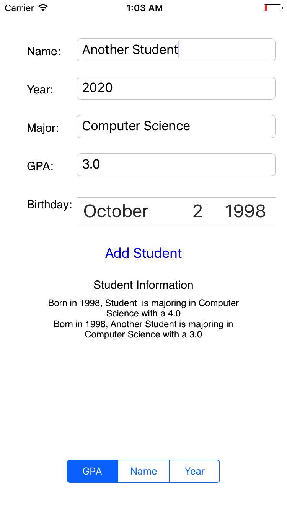
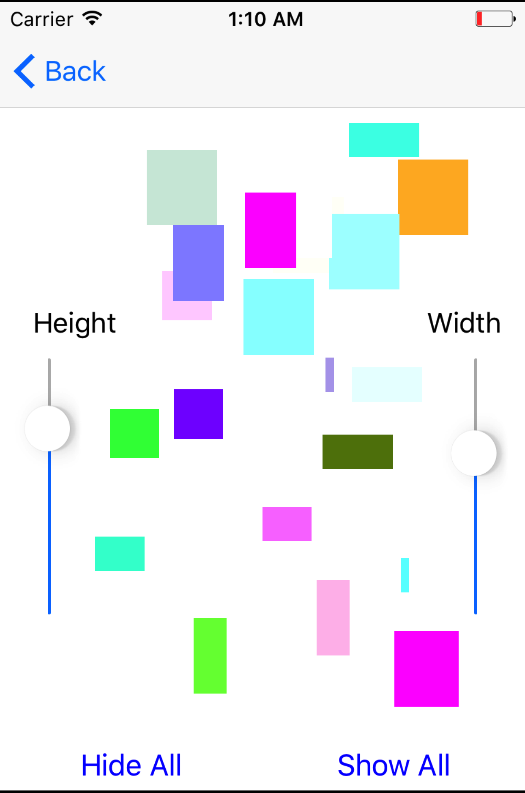
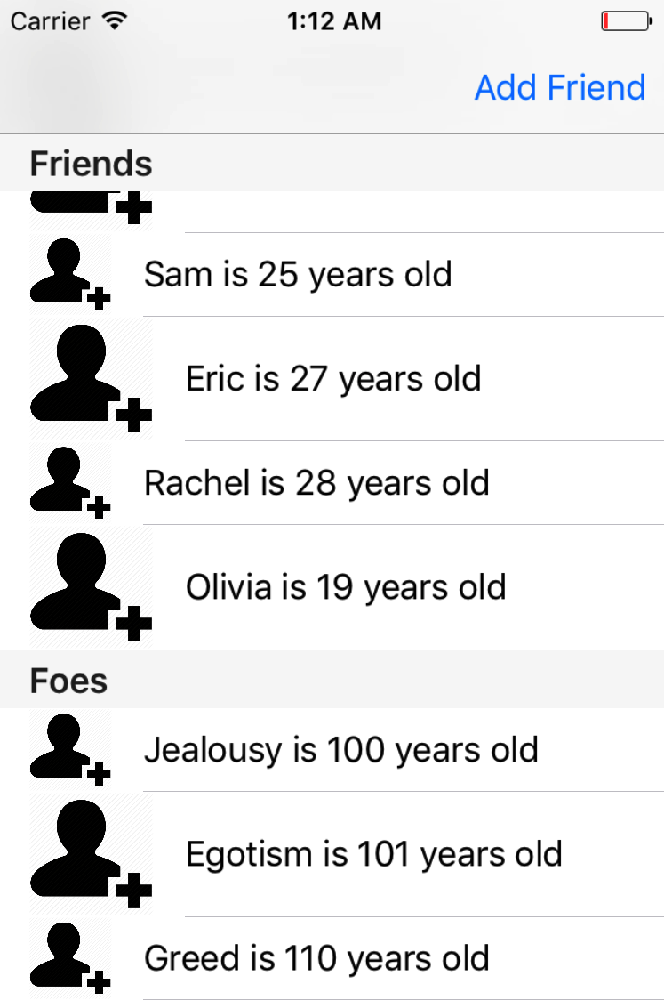
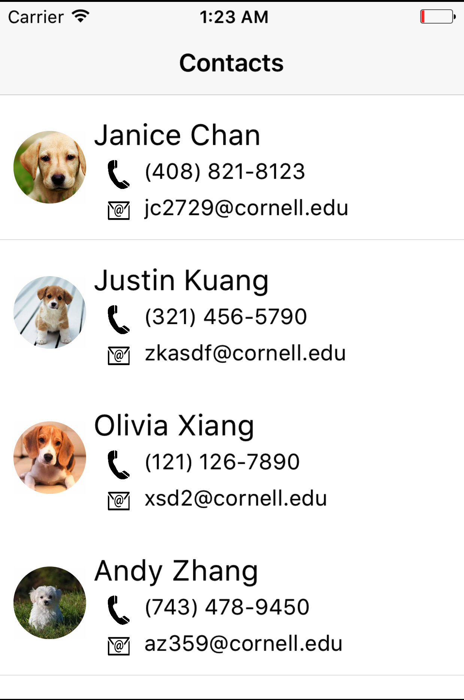
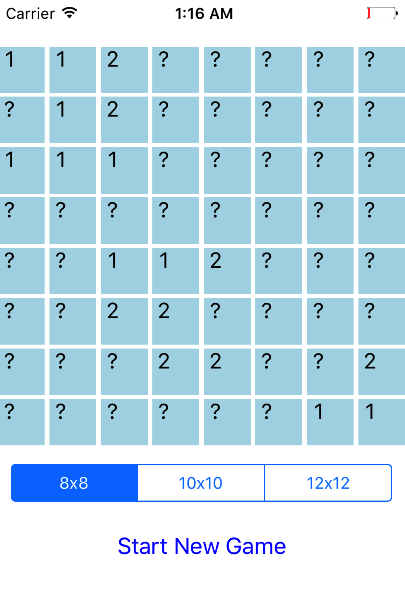

# CUAppDev-Training
Projects from the Intro to iOS App Development Course taught by CUAppDev, a project team at Cornell.

I took this course in Spring 2017 and have finished tackling the remaining challenge problems in the following projects as of July 2017:
1. Student Info App

2. Square Arena App

3. Friends App

4. Contacts App

5. Tinder App

6. Minesweeper App

